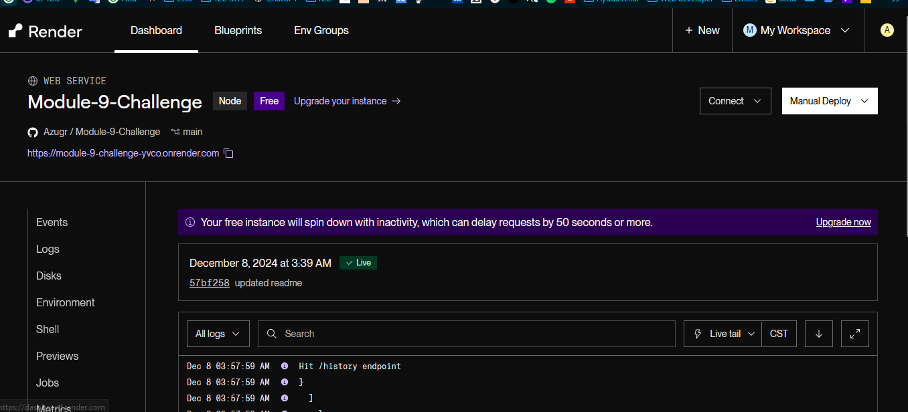

# Module-9-Challenge: Weather Dashboard

This project is a Weather Dashboard application that allows users to view current weather conditions and a five-day forecast for cities around the world. It utilizes the OpenWeather API for data and is designed with a simple and responsive UI.

## Features

- **City Search**: Search for any city to view its weather.
- **Current Weather**: Shows temperature, wind speed, humidity, and an icon representing the weather.
- **5-Day Forecast**: Displays date, temperature, wind speed, humidity, and a weather icon.
- **Search History**: Previously searched cities are saved for quick access.

## Technologies Used

- **Node.js** and **Express** for the back-end.
- **OpenWeather API** to fetch weather data.
- **Render** for deployment.

## Installation

1. Clone the repository:

    ```bash
    git clone https://github.com/your-username/Module-9-Challenge.git
    cd Module-9-Challenge
    ```

2. Install dependencies:

    ```bash
    npm install
    ```

3. Set up Environment Variables:

    - Register for an API key at [OpenWeather](https://openweathermap.org/).
    - Create a `.env` file in the root directory and add your API key:

      ```plaintext
      OPENWEATHER_API_KEY=your_api_key_here
      ```

4. Run the Server:

    ```bash
    npm start
    ```

5. View in Browser:

    Open [http://localhost:3000](http://localhost:3000) in your browser to access the app.

## Usage

1. Enter a city in the search box and click **"Search"** to fetch weather data.
2. View **Current Weather** and **5-Day Forecast** in the main area.
3. Click a city in the **Search History** to reload weather data for that city.

## Deployment

The app is deployed on Render. [View the live application here](https://module-9-challenge-yvco.onrender.com/).

### Weather App Screenshot


### Deployed App on Render



## License

This project is licensed under the MIT License.
